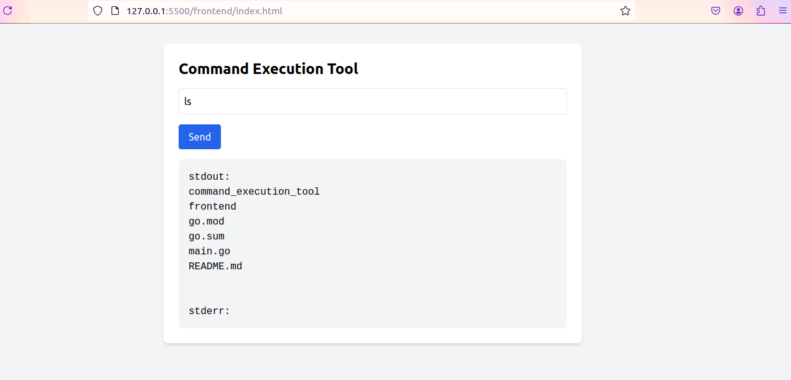

# Command Execution Tool

- Command Execution Tool is written in GoLang, it has one `index.html` and one `main.go` both should be run seprately.
- Go server is runing on port 31337 and cmd is `go run main.go`
- This repo conatin one binary file also, if you are using Linux/MacOS try : `./command_execution_tool` and if Windows os : `command_execution_tool.exe`

### Image
